# Rows_Of_Four

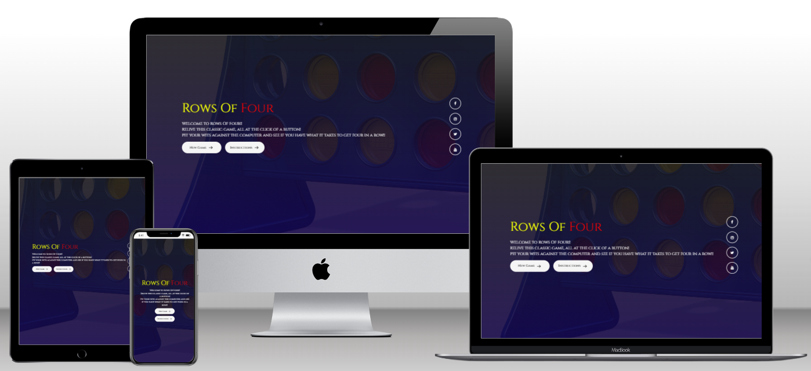

Rows Of Four is an extension of the popular game connect 4.

The game was created by Howard Wexler, and first sold under the Connect Four trademark by Milton Bradley in February 1974.

This website is created to have fun playing this game against the computer. 

Visit the deployed website [here](https://genty83.github.io/Rows_Of_Four/).

## Table of Contents

1. [User Experience (UX)](#user-experience-UX)
    1. [Project Goals](#project-goals)
    2. [User Stories](#user-stories)
    3. [Color Scheme](#color-scheme)
    4. [Typography](#typography)
    5. [Wireframes](#wireframes)
2. [Features](#features)
    1. [General](#general)
    2. [Home Section](#home-section)
    3. [Instructions Section](#instructions-section)
    4. [Game section](#game-section)
3. [Technologies Used](#technologies-used)
    1. [Languages Used](#languages-used)
    2. [Frameworks, Libraries and Programs Used](#frameworks-libraries-and-programs-used)
4. [Testing](#testing)
    1. [Testing User Stories](#testing-user-stories)
    2. [Code Validation](#code-validation)
    3. [Accessibility](#accessibility)
    4. [Tools Testing](#tools-testing)
    5. [Manual Testing](#manual-testing)
5. [Finished Product](#finished-product)
6. [Deployment](#deployment)
    1. [GitHub Pages](#github-pages)
7. [Credits](#credits)
    1. [Code](#code)
8. [Acknowledgements](#acknowledgements)

***

## User Experience (UX)

### Project Goals

* The website provides a structure easy to understand and navigate.

* Contains fun colors and interactivity to engage the player in the game play.

* Responsive design to make the game accessible on different devices.

* Incorporates a instructions section that is easily accessible to the player.

### User Stories

* As a player, I want the game's website to be easy to navigate.

* As a player, I want the game to be fun and engaging.

* As a player, I want to have easy access to the game instructions.

* As a player, I want the game controls to be easy to access during the game.

* As a player, I want to be able to play the game on different devices.

### Color Scheme

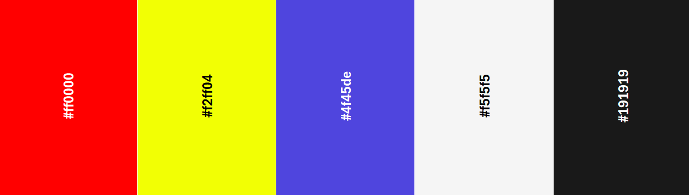

The colours used in the site are blue (#4f45de) for the nav bar and button hover. The yellow (#f2ff04) and red (#ff0000) are used in the heading text and are the base coin colours in the game.
There is a mixture of white (#f5f5f5) and black (#191919) text dependent on the background.
The colours take inspiration from the original board and coin colours from the game.

### Typography

The main font used in the site is Cinzel, with a fallback font of Serif as suggested by google fonts.

### Wireframes

[figma](https://figma.com/) has been used to showcase the appearance of the site and display the placement of the different elements wthiin the pages.

Page | Desktop | Mobile
--- | --- | ---
Home section | 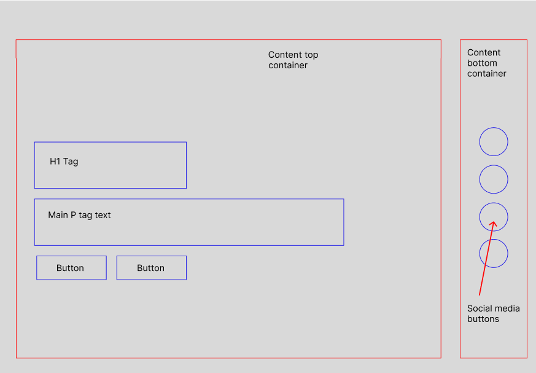 | 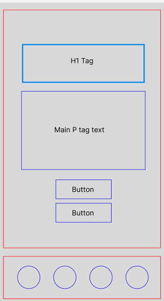
Game section| 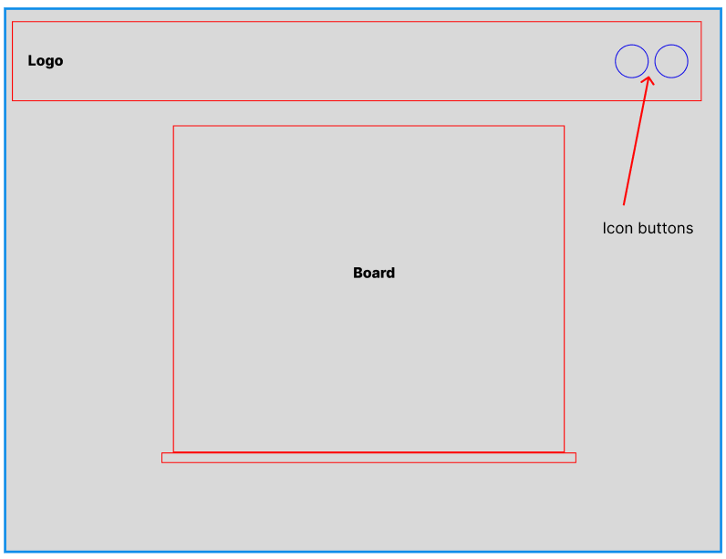 | 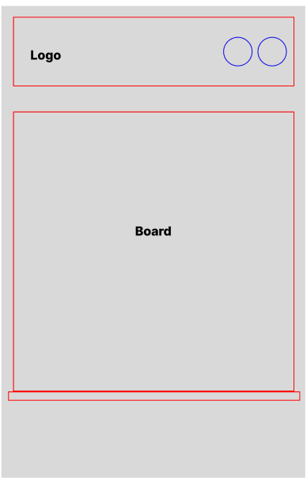
404 Page | 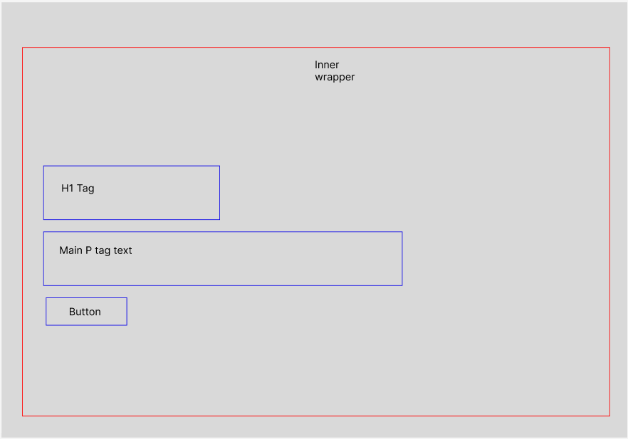 | 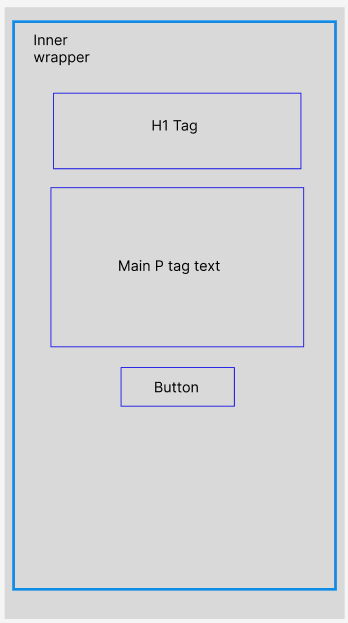

[Back to top ⇧](#Rows_Of_Four)

## Features

### General

* The website has been designed from a mobile first perspective.

* Responsive design across all device sizes.

### Home Section
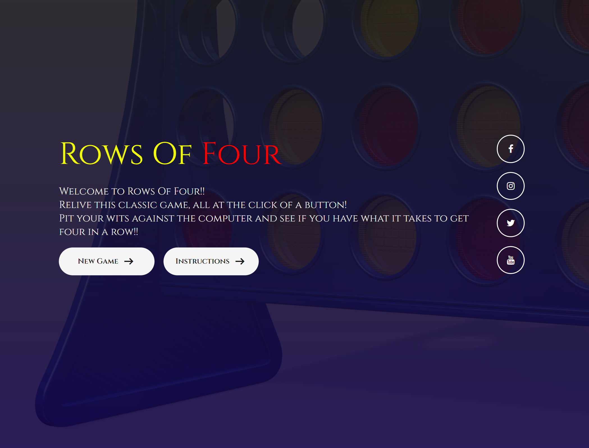

* **Main Image**
    - The main image has been selected to represent the game in a fun way in order to engage the player.

* **Main Buttons**
    - The start a new game button works as a link to the game section.

    - The instructions button opens the instructions popup window.

* **Social Media Links** 
    - Provides links to social media sites which open in a seperate tab.

### Game section
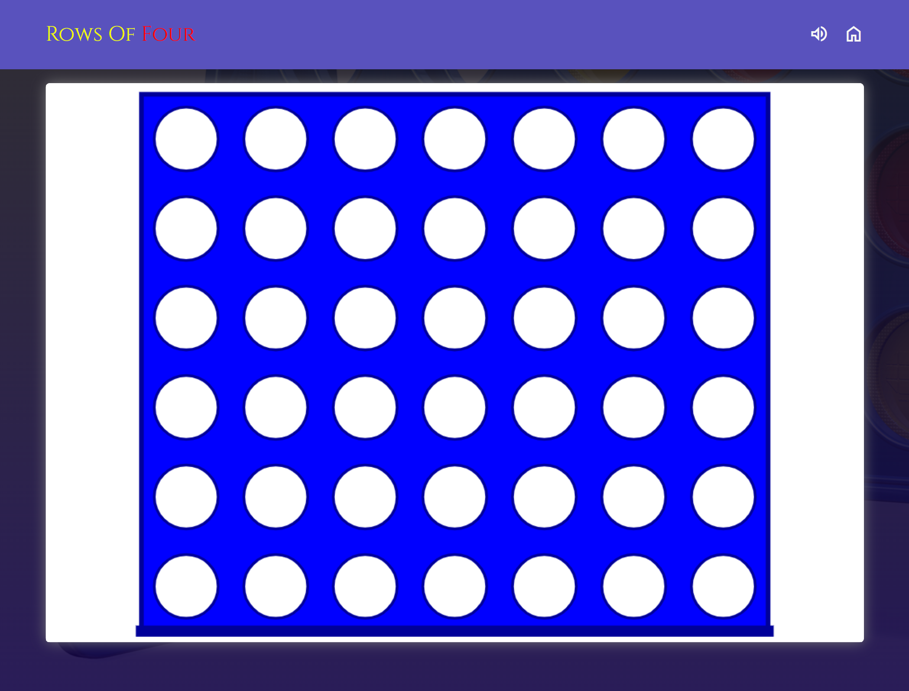

* **Header**
    - The header displays the logo and 2 icon buttons that allow the user to toggle the game sounds and return to the home page.

* **Game Area**
    - Displays the rows of four board.
    - The board is displayed inside a container that can be customized through the game options popup menu.

### 404 Error Page
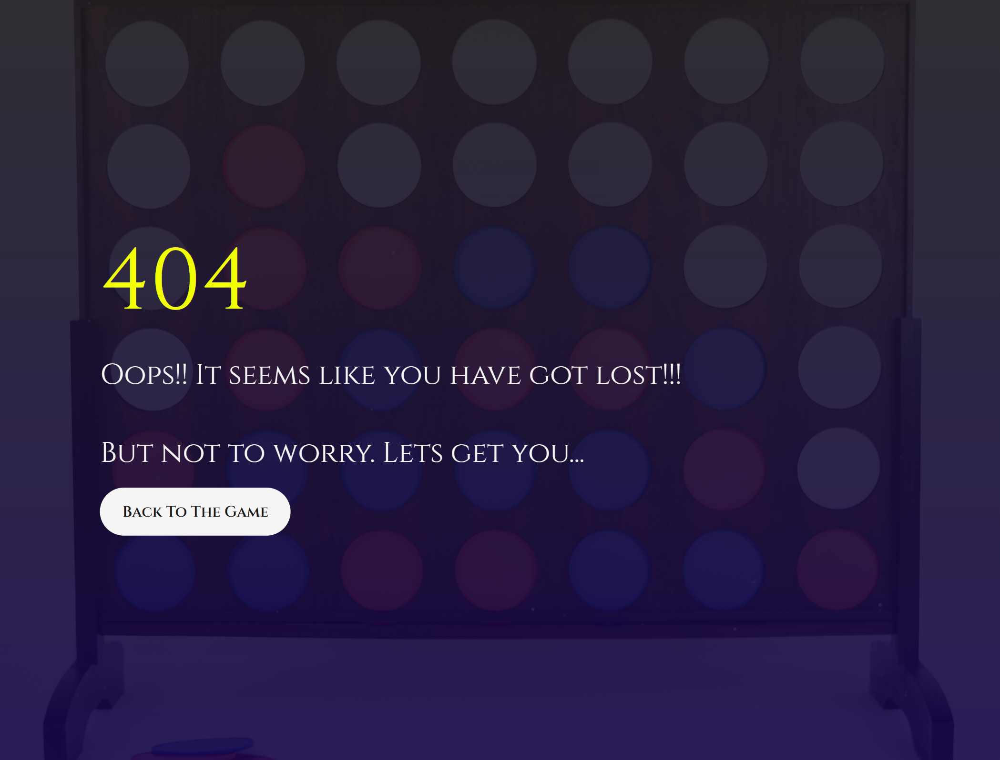

*  This single page is being shown in case the customer enters an incorrect address into the address bar. It contains a link to the home section.

[Back to top ⇧](#Rows_Of_Four)

## Technologies Used

### Languages Used
* [HTML5](https://en.wikipedia.org/wiki/HTML5)
* [CSS3](https://en.wikipedia.org/wiki/CSS)
* [Javascript](https://en.wikipedia.org/wiki/JavaScript)

### Frameworks, Libraries and Programs Used

* [Google Fonts](https://fonts.google.com/)
    - Google Fonts was used to import the fonts Cinzel and Odibee Sans into the style.css file. These fonts were used throughout the site.

* [Font Awesome](https://fontawesome.com/)
     - Font Awesome was used throughout all pages to add icons in order to create a better visual experience for UX purposes.

* [VsCode](https://vscode.com/)
     - VsCode was used for writing code, committing, and then pushing to GitHub.

* [GitHub](https://github.com/)
     - GitHub was used to store the project after pushing.

* [Figma](https://figma.com/)
     - Figma was used to create the wireframes during the design phase of the project.

* [Am I Responsive?](http://ami.responsivedesign.is/#)
    - Am I Responsive was used in order to see responsive design throughout the process and to generate mockup imagery to be used.

* [Responsive Design Checker](https://www.responsivedesignchecker.com/)
    - Responsive Design Checker was used in the testing process to check responsiveness on various devices.

* [Chrome DevTools](https://developer.chrome.com/docs/devtools/)
    - Chrome DevTools was used during development process for code review and to test responsiveness.

* [W3C Markup Validator](https://validator.w3.org/)
    - W3C Markup Validator was used to validate the HTML code.

* [W3C CSS Validator](https://jigsaw.w3.org/css-validator/)
    - W3C CSS Validator was used to validate the CSS code.

* [JSHint](https://jshint.com/) 
    - The JSHints JavaScript Code Quality Tool was used to validate the site's JavaScript code.

[Back to top ⇧](#Rows_Of_Four)

## Testing

Please review the testing file to view all the manual testing for this project.

* [Manual Testing](./TESTING.md)

### Code Validation

Please review the testing file to view all the code validation for this project.

* [Manual Testing](./TESTING.md)

### Accessibility

* Used Lighthouse in Chrome DevTools to confirm that the colors and fonts being used in throughout the website are easy to read and accessible.

* Lighthouse reports

    - **index.html**

    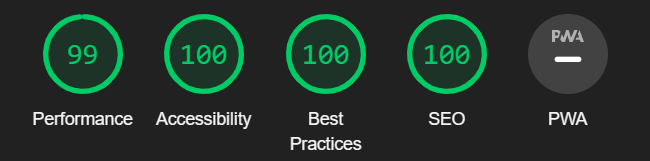

    - **404.html**

    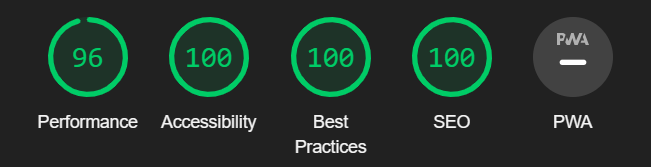

### Tools Testing

* [Chrome DevTools](https://developer.chrome.com/docs/devtools/)

    - Chrome DevTools was used during the development process to test, explore and modify HTML elements and CSS styles used in the project.

* Responsiveness

    - [Am I Responsive?](http://ami.responsivedesign.is/#) was used to check responsiveness of the site pages across different devices.

    - [Responsive Design Checker](https://www.responsivedesignchecker.com/) was used to check responsiveness of the site pages on different screen sizes.

    - Chrome DevTools was used to test responsiveness in different screen sizes during the development process.

* Device compatibility

Device | Outcome | Pass/Fail
--- | --- | ---
MacBook Pro 15" | No appearance, responsiveness nor functionality issues. | Pass
Dell Latitude 5300 | No appearance, responsiveness nor functionality issues. | Pass
iPad Pro 12.9" | No appearance, responsiveness nor functionality issues. | Pass
iPad Pro 10.5" | No appearance, responsiveness nor functionality issues. | Pass
iPhone XR | No appearance, responsiveness nor functionality issues. | Pass
iPhone 7 | No appearance, responsiveness nor functionality issues. | Pass

* Common Elements Testing

    - General

    Feature | Outcome | Pass/Fail
    --- | --- | ---
    Navigation Bar | Hover effect and links are working as expected. | Pass
    Social Links | Open the specific website on a new tab. | Pass

    - Home Section
    
    Feature | Outcome | Pass/Fail
    --- | --- | ---
    Start Game Button | Hover effect work and link to game section when button is clicked work as expected. | Pass
    Instructions Button | Hover effect work as expected and open instructions form popup when clicked. | Pass

    - Game Section

    Feature | Outcome | Pass/Fail
    --- | --- | ---
    Navbar button | The buttons work as expected | Pass
    Game board | The board hovering works as expected highlighting the correct cell | Pass

    - 404 Error Page

    Feature | Outcome | Pass/Fail
    --- | --- | ---
    404 Error Page | Entering an incorrect address into the address bar bring the player to the 404 error page. | Pass
    Back to the Game Button | Hover effect work and link to home section when button is clicked work as expected. | Pass

[Back to top ⇧](#Rows_Of_Four)

## Finished Product

Page / Section | Image
--- | ---
Desktop Version | 
Mobile Version | 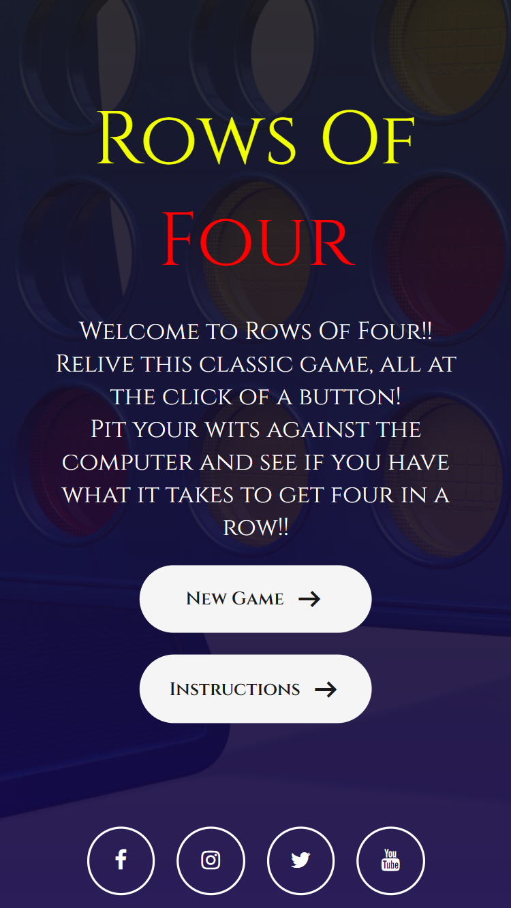
Options Popup | 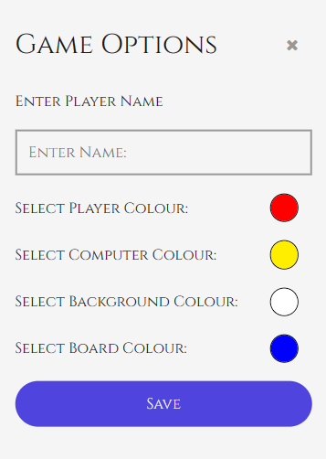
Instructions Section | 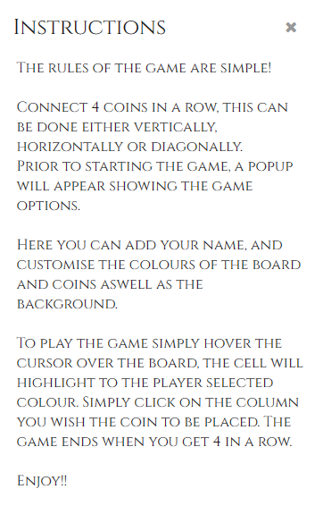
Game Section | 
404 Error Page | 

[Back to top ⇧](#Rows_Of_Four)

## Deployment

* This website was developed using [VsCode](https://www.vscode/), which was then committed and pushed to GitHub using the GitPod terminal.

### GitHub Pages

* Here are the steps to deploy this website to GitHub Pages from its GitHub repository:

    1. Log in to GitHub and locate the [GitHub Repository](https://github.com/).

    2. At the top of the Repository, locate the Settings button on the menu.

    3. Scroll down the Settings page until you locate the Pages section.

    4. Under Source, click the dropdown called None and select Master Branch.

    5. The page will refresh automatically and generate a link to your website.

[Back to top ⇧](#Rows_Of_Four)

## Credits

### Code

* [Stack Overflow](https://stackoverflow.com/), [CSS-Tricks](https://css-tricks.com/) and [W3Schools](https://www.w3schools.com/) were consulted on a regular basis for inspiration and sometimes to be able to better understand the code being implement.

[Back to top ⇧](#Rows_Of_Four)

## Acknowledgements

* My partner, for her unconditional love, help and continued support in all aspects of life to make possible for me to complete this project.

* My tutor, Marcel, for his invaluable feedback and guidance.

* Code Institute and its amazing Slack community for their support and providing me with the necessary knowledge to complete this project.

[Back to top ⇧](#Rows_Of_Four)