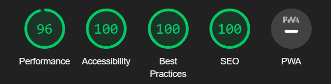

# Testing

## Contents

This site has been tested using the following testing procedures

* [Code Validation](#Code-validation)  

* [Lighthouse Testing](#Lighthouse-Testing)

* [Browser Compatibility](#Browser-Compatibility)

* [Manual Testing](#Manual-Testing)

* [Automated Testing](#Automated-Testing)

## Code Validation

The HTML code was validated using the [W3C Markup Validator](https://validator.w3.org/).

The CSS code was validated using the [W3C CSS Validator](https://jigsaw.w3.org/css-validator/).

The Javascript was validated using gthe [JSHints JavaScript Code Quality Tool](https://jshint.com/).

### W3C Markup validator

File | Image | Pass/Fail | Comments 
--- | --- | --- | ---
index.html |  | Pass | W3C Markup Validator returned no errors in the code but returned 1 info warning regarding a trailing slash on a link tag.
404.html |  | Pass | Code passed through with no issues. There was 1 trailing slash warning on a link tag which has been rectified.

### W3C CSS validator

File | Image | Pass/Fail | Comments 
--- | --- | --- | ---
style.css |  | Pass | CSS file passed through with no errors or warnings.

### JsHint Code Quality Tool

File | Image | Pass/Fail | Comments 
--- | --- | --- | ---
index.js |  | Pass | 2 warning were shown for missing semicolons. These have now been resolved.
game.js |  | Pass | 1 warning for a missing semicolon was shown which has now been resolved.
classes.js |  | Pass | No issues were found when passing the file through the validator.

[Back to top ⇧](#Testing)

## Lighthouse Testing

### index.html file

Screen Size | Image | Pass/Fail | Comments 
--- | --- | --- | ---
Desktop |  | Pass | No issues found when lighthouse report was ran on desktop version.
Mobile |  | Pass | No issues found when lighthouse report was ran on mobile version.

### 404.html file

Screen Size | Image | Pass/Fail | Comments 
--- | --- | --- | ---
Desktop |  | Pass | No issues found when lighthouse report was ran on desktop version.
Mobile |  | Pass | No issues found when lighthouse report was ran on mobile version.

[Back to top ⇧](#Testing)

## Browser Compatibility

**Desktop**  

Browser | Outcome | Pass/Fail
--- | --- | ---
Google Chrome  | No issues were found | Pass
Microsoft Edge | No issues found | Pass
Firefox | No issues found | Pass

**Mobile**  

Device | Outcome | Pass/Fail
--- | --- | ---
MacBook Pro 15" | No appearance, responsiveness nor functionality issues. | Pass
Dell Latitude 5300 | No appearance, responsiveness nor functionality issues. | Pass
iPad Pro 12.9" | No appearance, responsiveness nor functionality issues. | Pass
iPad Pro 10.5" | No appearance, responsiveness nor functionality issues. | Pass
iPhone XR | No appearance, responsiveness nor functionality issues. | Pass
iPhone 7 | No appearance, responsiveness nor functionality issues. | Pass

[Back to top ⇧](#Testing)

## Manual Testing Issues

### Landing Page

### Testing User Stories

* As a player, I want the game's website to be easy to navigate.

    - The website offers an intuitive structure for the player to find easily the information or section they are looking for.

    - The navigation bar is clearly presented to assist with the site's navigation.

* As a player, I want the game to be fun and engaging.

    - The game offers a level of customization for the user to change display aspects of the game. 

    - The computer difficulty is random offering players of all ages the abilty to beat the game.

* As a player, I want to have easy access to the game instructions.

    - The instructions are presents in a popup window easily accessable by clicking a button.

* As a player, I want the game controls to be easy to access during the game.

    - The game highlights on the board the colour of the player whos turn it is and where the coin will drop.

    - The controls are described in the instructions popup.

* As a player, I want to be able to play the game on different devices.

    - The game has been fully tested for responsiveness accross all devices.

Test | Outcome | Pass/Fail
--- | --- | ---
Facebook | When clicking on the facebook link, it opens a new page in the browser and redirects me to the site. | Pass
Instagram | When clicking on the instagram link, it opens a new page in the browser and redirects me to the site. | Pass
Twitter | When clicking on the twitter link, it opens a new page in the browser and redirects me to the site. | Pass
Twitter | When clicking on the twitter link, it opens a new page in the browser and redirects me to the site. | Pass

## Automated Testing Issues

[Back to top ⇧](#Testing)