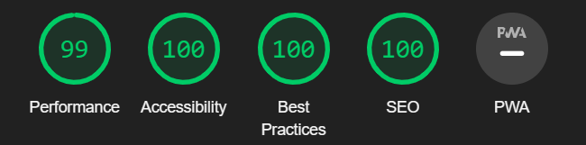

# Testing

## Contents

This site has been tested using the following testing procedures

* [Code Validation](#Code-validation)  

* [Lighthouse Testing](#Lighthouse-Testing)

* [Browser Compatibility](#Browser-Compatibility)

* [Manual Testing](#Manual-Testing)

* [Bug Reporting](#Bug-Reporting)

## Code Validation

The HTML code was validated using the [W3C Markup Validator](https://validator.w3.org/).

The CSS code was validated using the [W3C CSS Validator](https://jigsaw.w3.org/css-validator/).

The Javascript was validated using gthe [JSHints JavaScript Code Quality Tool](https://jshint.com/).

### W3C Markup validator

File | Image | Pass/Fail | Comments 
--- | --- | --- | ---
index.html |  | Pass | W3C Markup Validator returned no errors in the code but returned 1 info warning regarding a trailing slash on a link tag.
404.html |  | Pass | Code passed through with no issues. There was 1 trailing slash warning on a link tag which has been rectified.

### W3C CSS validator

File | Image | Pass/Fail | Comments 
--- | --- | --- | ---
style.css |  | Pass | CSS file passed through with no errors or warnings.

### JsHint Code Quality Tool

File | Image | Pass/Fail | Comments 
--- | --- | --- | ---
index.js |  | Pass | 2 warning were shown for missing semicolons. These have now been resolved.
game.js |  | Pass | 1 warning for a missing semicolon was shown which has now been resolved.
classes.js |  | Pass | No issues were found when passing the file through the validator.

[Back to top ⇧](#Testing)

## Lighthouse Testing

### index.html file

Screen Size | Image | Pass/Fail | Comments 
--- | --- | --- | ---
Desktop |  | Pass | No issues found when lighthouse report was ran on desktop version.
Mobile |  | Pass | No issues found when lighthouse report was ran on mobile version.

### 404.html file

Screen Size | Image | Pass/Fail | Comments 
--- | --- | --- | ---
Desktop |  | Pass | No issues found when lighthouse report was ran on desktop version.
Mobile |  | Pass | No issues found when lighthouse report was ran on mobile version.

[Back to top ⇧](#Testing)

## Browser Compatibility

